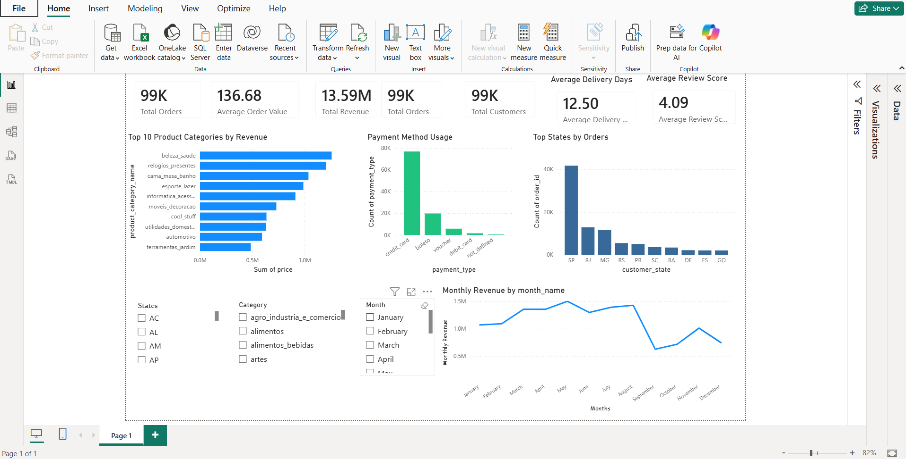

# E-Commerce Customer Analytics Dashboard

## Project Overview

This project analyzes customer behavior, sales performance, payment methods, and delivery performance using the Olist E-Commerce Dataset.

The goal is to generate business insights and build an interactive Power BI dashboard for decision-making.

---

## Dataset

Dataset Used: Olist E-Commerce Dataset

Records:

- Customers: 99,441
- Orders: 99,441
- Products: 32,951
- Payments: 103,886
- Reviews: 99,224
- Order Items: 112,650
- Sellers: 3,095

---

## Tools Used

- Python
- Pandas
- NumPy
- Matplotlib
- Jupyter Notebook
- Power BI
- Git
- GitHub

---

## Project Structure

```text
ecommerce-customer-analytics
│
├── data
├── dashboard
├── notebooks
├── images
├── reports
├── sql
├── requirements.txt
└── README.md
```

## Analysis Performed

### Data Understanding

- Explored dataset structure
- Checked dimensions and data types
- Identified missing values

### Data Cleaning

- Handled missing values
- Converted date columns
- Created cleaned datasets

### Revenue Analysis

- Total Revenue
- Average Order Value
- Top Product Categories

### Customer Analysis

- Customer Distribution by State
- Order Trends
- Customer Insights

### Delivery & Review Analysis

- Average Delivery Time
- Customer Review Analysis
- Delivery Performance Metrics

---

## Key Findings

- Total Revenue: 13.59 Million
- Average Order Value: 136.68
- Average Delivery Days: 12.50
- Average Review Score: 4.09
- Most Popular Payment Method: Credit Card
- Highest Revenue Category: Beauty & Health

---

## Dashboard Preview

### Full Dashboard



---

## Future Improvements

- Customer Segmentation
- Predictive Analytics
- Sales Forecasting
- Customer Lifetime Value Analysis

---

## Author

Pranav Patole

B.Tech CSE (Data Science)
